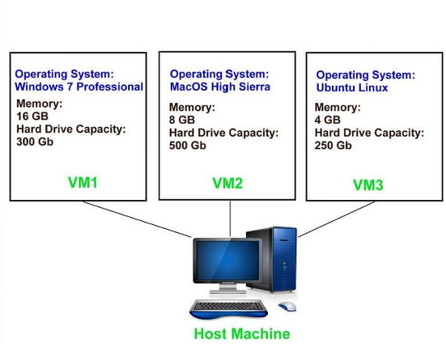

# Johdanto
## Virtualisointi
Lähtökohtaisesti yhdessä tietokoneessa on yksi laitteisto ja siihen asennettu käyttöjärjestelmä sekä sovellukset. Toisin sanottuna tässä tapauksessa jokainen käyttöjärjestelmä tarvitsee oman fyysisen tietokoneen.

*Virtualisointi* on menetelmä, jossa käytetään ohjelmistoja kuten VMWare tai Hyper-V luomaan tietokonelaitteiston päälle abstraktiokerros, jonka avulla yksittäisen tietokoneen laitteistoelementit – prosessorit, muisti, tallennus ja paljon muuta – voidaan jakaa useiksi virtuaalikoneiksi. Jokaisella virtuaalikoneella (virtual machine, VM) voi olla oma käyttöjärjestelmänsä (operating system, OS) kuten Windows tai Linux ja se toimii kuin itsenäinen tietokone, vaikka se toimii vain osana todellista tietokonelaitteistoa. Virtualisointiin käytettävää ohjelmistoa kuten VMware tai Hyper-V kutsutaan virtualisointiympäristöksi, hypervisor. 

## Hypervisor

*Hypervisor* eli virtualisointiympäristö on välttämätön virtualisoinnissa – se on (ohut) ohjelmistokerros, jonka avulla useat käyttöjärjestelmät voivat toimia rinnakkain ja jakaa samat fyysiset laskentaresurssit. Nämä 
käyttöjärjestelmät ovat virtuaalikoneita (VM) – fyysisen tietokoneen virtuaalisia esityksiä – ja hypervisor määrittää kullekin virtuaalikoneelle oman osuutensa taustalla olevasta laskentatehosta, muistista ja tallennustilasta. Tämä estää virtuaalikoneita häiritsemästä toisiaan.

## Virtuaalikone

*Virtuaalikone* (virtual machine, VM) viittaa tietokoneohjelman tai -ympäristön simulointiin tai emulointiin toisen tietokoneen sisällä. Se mahdollistaa useiden erilaisten käyttöjärjestelmien tai ohjelmistoympäristöjen ajamisen samassa fyysisessä tietokoneessa eristetyissä virtuaaliympäristöissä.

Virtuaalikoneet ovat hyödyllisiä esimerkiksi, kun halutaan suorittaa vanhempia tai erikoistuneita 
käyttöjärjestelmiä, kokeilla uusia ohjelmistoja riskittömässä ympäristössä tai luoda skaalautuvia 
palvelinympäristöjä ilman fyysisten tietokoneiden lisäämistä. Tämä on myös hyödyllistä esimerkiksi testauksessa ja kehityksessä, koska se eristää eri ohjelmistoympäristöt toisistaan, vähentäen häiriöitä ja konflikteja.

## Virtualisointitapoja

Virtualisointi voidaan toteuttaa kahdella eri päätavalla:

1. **Isäntäkäyttöjärjestelmän avulla (host-OS)**

    Tässä tavassa laitteistoon on asennettu täysi käyttöjärjestelmä kuten Windows tai Linux, joka toimii isäntänä (host-OS). Host-OS:aan on asennettu virtualisointiympäristö.

    

2. **Ilman erillistä isäntäkäyttöjärjestelmää (bare metal hypervisor)**
    Tässä tavassa laitteistoon on asennettu täyden käyttöjärjestelmän sijaan ilman erillistä host-OS:aa toimiva (type 1) hypervisor kuten Proxmox (tai VMwaren ESXi).

    

## Virtualisoinnin hyödyt

Virtualisointia käytetään mm. seuraavista syistä:
- **Resurssitehokkuus**: Ennen virtualisointia jokainen sovelluspalvelin vaati oman fyysisen prosessorin. Tällöin
jokainen fyysinen palvelin on usein vajaakäytössä. Sitä vastoin palvelimen virtualisoinnin avulla voidaan ajaa useita sovelluksia – jokaista omassa virtuaalikoneessa, jossa on oma käyttöjärjestelmä – yhdessä fyysisessä tietokoneessa. Tämä mahdollistaa fyysisen laitteiston kapasiteetin optimaalisemman hyödyntämisen.
- **Helpompi hallinta**: Fyysisten tietokoneiden korvaaminen virtualisointiympäristössä määritellyillä 
virtuaalikoneilla helpottaa niiden käyttöä ja hallintaa. Palvelinvirtualisointijärjestelmissä on 
keskitetyt hallintasovellukset, joissa kaikkien virtuaalipalvelimien tilaa voidaan seurata ja säätää 
tarpeen mukaan. 
- **Minimaalinen seisokkiaika**: Käyttöjärjestelmän ja sovellusten kaatumiset voivat aiheuttaa 
seisokkeja ja häiritä käyttäjien tuottavuutta. Järjestelmänvalvojat voivat käyttää useita 
toisinnettuja virtuaalikoneita rinnakkain, mikä parantaa vikasietoa, kun ongelmia ilmenee. 
Useiden redundanttien fyysisten palvelimien käyttäminen on virtualisoituja kalliimpaa. 
- **Nopeampi käyttöönotto**: Jokaisen sovelluksen laitteiston ostaminen, asentaminen ja 
määrittäminen vie aikaa. Edellyttäen, että laitteisto on jo olemassa, virtuaalikoneiden 
pystyttäminen käyttökuntoon on nopeampaa. 

## Lisätietoa

- Virtualisointi, hypervisor ja virtuaalikoneet (video, YouTube, n. 8 min): [Virtualization Explained](https://youtu.be/UBVVq-xz5i0?t=3)
- Virtualisoinnin hyödyt (video, YouTube, n. 5 min): [The Benefits of Virtualization](https://youtu.be/vUUC_eDb2z0?t=5)

## Tekijät
Seinäjoen ammattikorkeakoulu, alkuperäinen teksti Alpo Anttonen ja webmuunnos sekä muokkaukset Raine Kauppinen.

